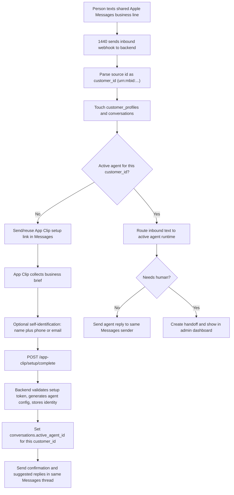

# Current Flow And Test Cases

Date: 2026-06-03
Backend version: 0.1.5
Synced app version: 1.0.5

## Identity Reality

The Apple Messages for Business sender that 1440 forwards to us is an opaque Messages id such as `urn:mbid:...`. Treat that id as the stable customer/thread key for routing and replies.

Do not assume Apple or 1440 will provide the person's phone number, email address, iCloud account, or real name. The backend now inspects inbound webhook field names and logs a masked `[webhook:fields]` summary so Railway can prove exactly what the current 1440 payload includes.

If the product needs a recognizable name, phone, or email, collect it explicitly. The App Clip now includes an optional self-identification step and sends that data as `identity` during setup completion. The backend stores it in `customer_profiles` for the same `customer_id`.

## Runtime Flow



## What To Test

1. New anonymous sender
   - Text the shared business line from a fresh Messages account.
   - Expected: dashboard shows the sender as a compact `urn:mbid:...` until the person self-identifies.
   - Railway: `[webhook:fields]` should show sender id candidates and usually empty `phoneLike`, `emailLike`, and `displayNames`.

2. App Clip setup with self-identification
   - Open the setup App Clip from Messages.
   - Enter a business brief.
   - On the identity step, enter `Jane Lee` and `jane@example.com` or a phone number.
   - Complete setup.
   - Expected: backend stores the identity on `customer_profiles`, and dashboard sender views show the self-declared name/contact instead of only the opaque id.

3. App Clip setup without self-identification
   - Leave identity fields blank.
   - Expected: setup still succeeds. The conversation remains keyed and displayed by `urn:mbid:...`.

4. Existing active agent
   - After setup completes, send another message in the same Messages thread.
   - Expected: the backend routes to `conversations.active_agent_id` and replies as the generated agent.

5. Handoff
   - Ask for a human or send a request outside the configured agent boundary.
   - Expected: a handoff appears in the admin dashboard, and automation pauses or marks the conversation as needing human attention.

6. Railway payload capture
   - After sending a live inbound Messages payload, inspect logs:

```bash
railway logs --lines 200 --filter "webhook:fields"
```

If `phoneLike`, `emailLike`, or `displayNames` are empty, the current 1440 webhook did not send those values. That is expected for standard Apple Messages for Business privacy behavior.

7. Reset the one-number test sender
   - Open Admin Dashboard.
   - Select the Messages sender.
   - Use "Reset sender".
   - Expected: profile, conversations, handoffs, appointments, auth codes, workspace identity, setup bindings, and linked generated agents are removed where the current Supabase schema supports them.

## Stronger Identity Options

- Keep the current optional App Clip identity step for the demo.
- Add an explicit authentication card or OAuth link if the business needs verified identity.
- Add a later profile-edit screen in the full app so the person can update their self-declared identity after setup.
